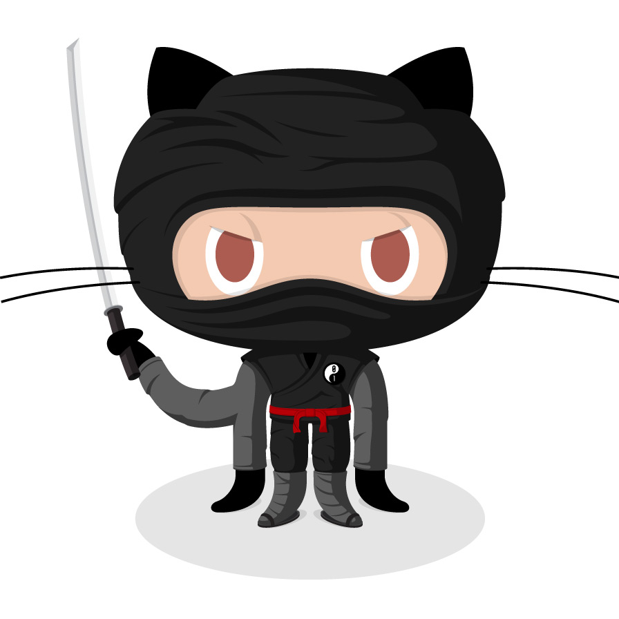

# textify

> Every project needs a logo, so why not an ascii one.

A Rust rewrite of [asciify](https://github.com/butlerx/asciify). Converts PNG and
JPEG images into ascii art, from the command line or in the browser.

## Demo

_Before_



_After_ — `textify --print octocat.png`

```
           :,            ~*~:                                          :~==
           ~            ~MMMMN87=                                  ~IONMMMM?
           ~,           ZMMMMMMMMNZ=        ,,::::::::,,        ~7DMMMMMMMMN
           :,           NMMMMMMMMMMMDII$ZO8DDDNNNNNNNNNNDD8O$II8MMMMMMMMMMMM=
           :,          :MMMMMMMMMMNDNNNNNNNNNDDDDDDDNNNNNNMMMMMMNMMMMMMMMMMM?
           ::          ~MMMMMMMMMNDDDDDDDDDNNNNNNNNNNNNNNNNNNNNNNNNMMMMMMMMMI
           ,:          ,MMMMMMMMNDDDDDDDDDDDDDDDDDDDDDDDDDDDDNNNNNNNMMMMMMMM*
           ,~           8NNNNNNNNNNNNNNNNDDDDDDDDDDDDDDDDDDDDDDDNNNNNNNNNNMM,
            ~,        ,ZDDNNNNNNNNNNNNDNNNNDDDNNNDDDDDDDDDDNNNNNNNNNNNNNNNNN8:
            ~,       :8NNNNDDDDDDDDDDDDDDDNNNDDDDNNNNNNDDDDDDDDDDDDDDNNNNNNNMN=
            ::      :DNDDDDDNNNNNNNNNNNNNDDDDDDDDDDDDDDDDDDDDDDDDDDDDDNNNNNNNNM~
            ,:      ONDDDDDDDDDDDDDDDDDNNNNNNNDDDDDDNNNNNNNNNNNNNNNNNNNNNNNNNNMN,
            ,~     INDDDDDDDDNNNNNDDDDDDDDDDDDDDDDDNNNNNNNNNNNNNNNNNDDNNNNNNNNNMZ
             ~,   ,DNDDDNNNNNDDDDDDDDDDDDDDDDDDDDDDDDDDDDDDDDDDDDDDDDDDDDNNNNNNNN:
             :,   *NDDNNNDDDDDDDDDDDDDDDDDDDDDDDDDDDDDDDDNNNNNNNNNNDDDDDDNNNNNNNMI
             ::   INNNNDDDDDDDDDNNNNNNNNNNNNNNNNNNNNNNNNMMMMMMMNNNNNNNNNDDNNNNNNM7
             ,~   7MDDDDDDDDDNNNND8OOOOZZOOOOOOOOOOOOOOOOOOOOOOOO8DNNNNNNDNNNNNNN:
              ~,  :DDDDDDDDDNN87*=~:::::::::::::::::::::::::::::~~=*IONNNNNNNNNNN,
              ::   ONDDDDDDNN$~:::::::::~~::::::::::::::::::::::~::::~7DNNNNNNNMD
              ,:   ZNDDDDDDN$::::: ~7I?=~~~:::::::::::::::::~*?77: ::::7NNNNNNNMO
               ~,  $MDDDDDDD=::::  7$$$$I ,:::::::::::::::, I$$7$7 ,:::~8NNNNNNM7
               :,  ~DDDDDDN8~:::: ,$77777  :::::::::::::::  77777$, ::::ZNNNNNNM~
      ,,:::::~:=*~~:ZNDDDDN8=::::  7$77$I ,~:::::::::::::~, I$77$7 ,::::ONNNNNM8:~~~~~~:::::,,,
~===~~~:::,,,,,:=:::~NDDDDDNI::::: :7$$I, ::::~~====~~::::: ,I$$7: ::::=NNNNNNM*,::,,,,,,,:::~~~===~
        ,,::~~~~**~~:ZMDDDDN8=::::,  ,,  ~*I$O8DDNNDD8O$I*~,  ,,  :::::ONNNNNM8~~~~~~~~~:::,
,:~~===~~::,,   ,:    ZMDDDDN8=~~~~~~~*7ODNMMMNNNNNNNNNMMNDO$?~::~~~~~ZNNNNNMD,        ,,::~~~==~~:,
::,,             =*~   7NNDDDND888DDNNMMNNNDDDDDDNNNDDDDDNNNMMMNDD8DDDNNNNMMZ,                   ,:~
                 $M7    ~ZNNNDDNNNNNNDDDDDNNNNNNNNNNNNNNNNNDDDNNNNMNNNNMMMO=
                 :88::,   :IONNNNNDDDNNNNNNNNNNNNDDDNNNNNNNNNNNNNNNMMMMD7~
                 :DMMM8      :?$8NNMMNNNNDDDDDDDDDDDDDDDNNNNMMMMMMNDZI~
                 ZMMMMD*         ,=?7ZOODNNNNNNNNNNNNNNNNNNNOOZ7?=:
                 ,78DNMMZ:             IDNNNNNNNNMMNNMNNNNNN$
                   :DNNOOO?           ,ODNNDDDDDDNMN87ONDNNDN~
                    INO$$ZZ?          ?Z$8DNDDDDNNDMI*DMDNOO8$
                     ,:ZO$$Z$*:,    ,=ZZ$O8DDDNNNNDDDNMNNO$Z8D~
                       ~$Z$$ZZZ$Z$7$ZZZZZO8ODNNDDDNNNDDNOZZZ8D?
                         ?ZZ$$$ZZZZZ$$ZZZ8OIDDDDDDDDDDDN77ZZ8D7
                          ~7OOOZZZZZOOZ$ZDZ?NDDD8DD88DDN7?ZZ8D$
                            :*I$$ZZ$7$Z$Z8Z~NNNDN8ZNDNNM?IZZODI
                                     :ZZO8O*NDDDMZ?NDNNMI7OZ8D?
                                     ~Z$Z8O?NDDNMZ7NDNNM7IZZ8D?
                                     ~Z$Z8Z*NDDNMZ7NDDNM7?ZZ8D?
                                     ~ZZO8O~DNDNM7*MDNNM=7OO8DI
                               ,,,,,,:NMMMD,788DN?~8O8D8,ZMMMM=,,,,,,
                           ,,,,,,,,, *MMMM8 IZZ8DI~ZZO8O $MMMM7 ,,,,,,,,,
                        ,,,,,,,,,, ,?MMMMM= $ZO8D=:ZZZ88::NMMMM7: ,,,,,,,,,,
                       ,,,,,,,,,,,$MMMMNZ= *ZZO87,,*ZZZ8$ :$DMMMMO:,,,,,,,,,,
                      ,,,,,,,,,,,,*I?*~: ,78O8DD*,,~OOOZDZ: ,~**??,,,,,,,,,,,,
                      ,,,,,,,,,,,,    ,,,=OOZ$?~,,,,~?7$ZO?,,,    ,,,,,,,,,,,,
                       ,,,,,,,,,,,,,,,,,,,,,,  ,,,,,,  ,,,,,,,,,,,,,,,,,,,,,,
                         ,,,,,,,,,,,,,,,,,,,,,,,,,,,,,,,,,,,,,,,,,,,,,,,,,,,
                           ,,,,,,,,,,,,,,,,,,,,,,,,,,,,,,,,,,,,,,,,,,,,,,
                                ,,,,,,,,,,,,,,,,,,,,,,,,,,,,,,,,,,,,,
                                       ,,,,,,,,,,,,,,,,,,,,,,
```

## Layout

| Crate                            | What it is                                            |
| -------------------------------- | ----------------------------------------------------- |
| [`asciify`](crates/asciify) | The conversion library. No io, no network, wasm ready. |
| [`cli`](crates/cli)         | The `textify` command line tool.                       |
| [`web`](crates/web)         | A wasm frontend built with Leptos and Trunk.           |

## Install

```sh
cargo install --path crates/cli
```

## Usage

```sh
textify --print octocat.png                 # write the art to stdout
textify octocat.png                         # save it as ./octocat.txt
textify --path docs octocat.png             # save it as docs/octocat.txt
textify --width 200 octocat.png             # wider output, more detail
textify --readme README.md octocat.png      # inject it into a readme
textify https://example.com/logo.png        # fetch a remote image
```

| Flag              | Default           | Description                                     |
| ----------------- | ----------------- | ----------------------------------------------- |
| `-p`, `--print`   | off               | Print to stdout instead of writing a file.       |
| `-r`, `--readme`  |                   | Replace `{{ . }}` in a markdown file with the art. |
| `--path`          | current directory | Directory to write the `.txt` file to.           |
| `-w`, `--width`   | `100`             | Width of the output in characters.               |

### Injecting into a readme

Put a `{{ . }}` placeholder where the art should go, then point `--readme` at
the file. The placeholder is replaced with a fenced code block, so running it
twice needs the placeholder put back first.

```md
# my project

{{ . }}
```

## Web frontend

```sh
mise run dev        # trunk serve on http://localhost:8080
mise run web:build  # static files in crates/web/dist
```

Everything runs client side: the image never leaves the browser. Pasting a
remote url is subject to the host's CORS headers, so many image hosts will
refuse.

## Development

Toolchain and tasks are managed with [mise](https://mise.jdx.dev). `mise install`
pulls down Rust with the wasm target, trunk, and the lint tooling.

```sh
mise run hooks   # install the prek git hooks, once
mise run check   # format, lint, wasm target, tests, audit
```

| Task                | What it does                                  |
| ------------------- | --------------------------------------------- |
| `build` / `b`       | Build the workspace.                           |
| `run` / `r`         | Run the cli, e.g. `mise run r -- --print octocat.png`. |
| `dev` / `d`         | Trunk dev server for the frontend.             |
| `test` / `t`        | `cargo nextest` across the workspace.          |
| `format` / `f`      | `cargo fmt` plus `tombi format`.               |
| `lint`              | Clippy with `-D warnings`.                     |
| `web:check`         | Type-check the frontend against wasm.          |
| `check`             | Everything CI runs.                            |

`mise tasks` lists them all. Commit messages follow
[conventional commits](https://www.conventionalcommits.org), enforced by
[prek](https://prek.j178.dev).

## Differences from asciify

The output is the same art, but a few rough edges got filed off:

- **Transparency composites onto white.** asciify premultiplied onto black, so
  a logo with a cut out background came out as a solid block of `M`.
- **Url detection checks the scheme.** asciify used `url.ParseRequestURI`, which
  called `/tmp/logo.png` a url and tried to fetch it over http.
- **`--readme` fails loudly** when there is no `{{ . }}` placeholder. asciify's
  `html/template` silently truncated the readme to nothing.
- **Output filenames strip url query strings**, so `logo.png?raw=1` saves as
  `logo.txt`.

Resampling uses the `image` crate's Lanczos3 rather than `nfnt/resize`. Around
4% of characters land one step off along the ramp; the art is otherwise
identical.

## License

MIT. See [LICENSE](LICENSE).
